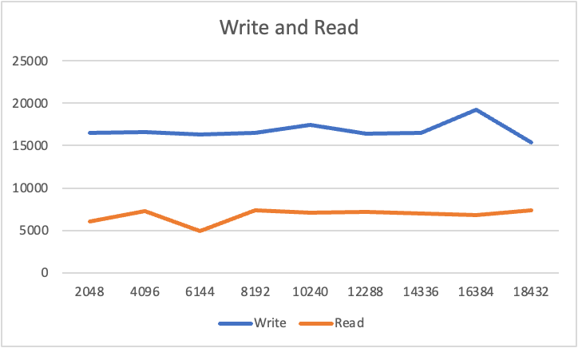
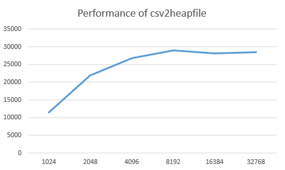
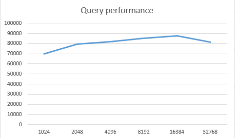
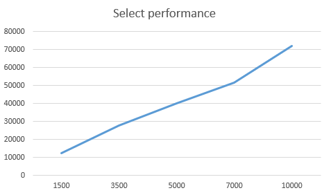
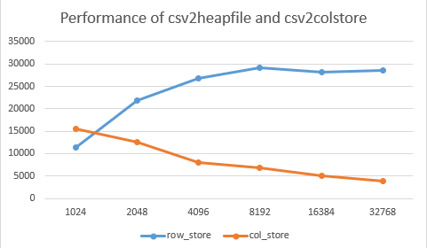
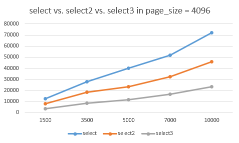

### Assignment 1.1

Yuchen Zhang 	yzh370@ur.rochester.edu

Ziqi Feng	zfeng16@ur.rochester.edu

Rui Guo	rguo7@ur.rochester.edu

#### Compile

```
cmake .
make
```

#### Run

```
./write_fixed_len_pages <csv_file> <page_file> <page_size>
./read_fixed_len_page <page_file> <page_size>
./csv2heapfile <csv_file> <heapfile> <page_size>
./scan <heapfile> <page_size>
./insert <heapfile> <csv_file> <page_size>
./update <heapfile> <record_id> <attribute_id> <new_value> <page_size>
./delete <heapfile> <record_id> <page_size>
./select <heapfile> <attribute_id> <start> <end> <page_size>
./csv2colstore <csv_file> <colstore_name> <page_size>
./select2  <colstore_name> <attribute_id> <start> <end> <page_size>
./select3  <colstore_name> <attribute_id> <return_attribute_id> <start> <end> <page_size>
```

**Note**

The program have some default numbers. If you want to test different data, please change the default number in `library.h`.

**slot_size**: the maximum capacity of each slot. 

```
SLOT_SIZE = 1000;
```

**attribute_size**: the size of each attribute. 

```
ATTRIBUTE_SIZE = 10;
```

**Important !!!**

If you trying to use column store, you need to change `SLOT_SIZE = ATTRIBUTE_SIZE`, and`LINE_SIZE= SIZE OF A RECORD`


#### Experiment 2.1

1. Calculate the size of the fixed length serialization of records in the table.

   Assume there are 100 attributes in a record and the size of each attribute is 10 Bytes. The size of the fixed length serialization of the record is 1000 in this example. 

2. Use `fixed_len_sizeof()` to check if it agrees with your calculation.

   The output of `fixed_len_sizeof()` is 1000.

#### Experiment 3.2

1. Plot the performance (records / second) versus page size for write and read.

   The y coordinate is the number of records per second. (Records/s)

   The x coordinate is the size of page. (Byte)



2. Compare this to the blocked disk I/O characteristics you observed in the tutorial.

   In the tutorial, we can read different data from a different tables from different page files. And if the record is too long for a page, the record can be stored in two pages to use disk space better. The above code only achieves the data from the same table, and these data will be stored in a page file. If the record size is larger than the half size of the page. The rest space on the page will be wasted.

3. Discuss why a page-based format is superior to storing records using a CSV file.

   1. The page-based format is good for storing large data. The data in the page file is sequential, the program can write or read quickly in the page-based file. But in the CSV file, the record will be split with '\n' and each record locate at its own line. 
   2. Increase hard drive utilization.
   3. The page-based format is easy to manipulate and manage, so we can find a record from a large data set quickly. In the CSV file, if we want to find a record, we need to traverse all the records in the file.
   4. Reduce the number of I/O, we can retrieve a single page from a page file instead of reading from the whole file.

4. Discuss the shortcomings of the way we organize pages. 

   The shortcomings of the way we organize pages are that we only store the data and some page management information. 

   The page does not have an index so if we try to find the data from a range we still need to traverse all the data. Besides, we do not declare the rest of the space on each page. When some data is deleted from a page, the space for deleted records will be wasted. Or we still need to traverse all the pages to get the empty space but that will waste a lot of time. 

   If we store all the data on a page, the size of the page file will be huge. Some hard drives may not support such large individual files. We need to split the page file and store data into multiple data spaces. 
   
   Page-based organization can lead to contention, which may cause locking and blocking issues if multiple threads. need to access the same page at the same time.

#### Experiment 4.3
1. Measure the performance of `csv2heapfile`, comment on how the page size affects the performance of load.

    The performance figure is shown as below. The abscissa is the page_size, and the ordinate is the number of records loaded per second. We can find that as the page size increases, the speed of loading data is faster, but it will not continue to increase when the page being too large.

    

2. Measure the performance of the query versus page size.

    The performance figure is shown as below. The abscissa is the page_size, and the ordinate is the number of records searched per second. 

    

3. Comment on the choice of page size and the effects of the range from  _start_  and  _end_  on the performance of the query.

   The performance figure with pagesize = 4096 is shown as below. The abscissa is the number of data hits by the query, and the ordinate is the number of records searched per second. 
   As the search area expands, the search speed also increases.
   
   

#### Experiment 5.2
1. Measure the performance of  `csv2colstore`  against different page sizes.

    The performance figure is shown as below. The abscissa is the page_size, and the ordinate is the number of records loaded per second. 

    

2. Compare the result with that of  `csv2heapfile`  in the previous section. Comment on the difference.

    We can find that in csv2colstore, as the page size increases, the speed of loading data is slower, which is opposite to csv2heapfile. It may because each page will take longer to fill up before it is written to disk. This means that there will be more page allocations and writes to disk, which can slow down the overall performance.
In contrast, in a row store, data is organized by rows, so each row is stored contiguously. When reading data from a CSV file in a row store, the program reads each row and store it sequentially in the heap file. In this case, a larger page size can be beneficial because it means that each page will store more rows, and hence fewer pages will be required to store the entire dataset. This can lead to faster performance because there will be fewer page allocations and writes to disk.

3. Compare the performance of  `select2`  with that of  `select`  in the previous section. Comment on the difference.

   The performance figure with pagesize = 4096 is shown as below. The abscissa is the number of data hits by the query, and the ordinate is the number of records searched per second. 
   We can see that both options speed up as the search range increases. The difference between the two is that the speed of select increases more than select2.

   

4. Compare the performance of  `select3`  with that of  `select`  and  `select2`. Comment on the difference especially with respect to different selection ranges (different values of start and end).

    The performance figure with pagesize = 4096 is shown in 5.2.3(the previous part). The abscissa is the number of data hits by the query, and the ordinate is the number of records searched per second. 
    We can see that all options speed up as the search range increases. The difference is that the increasing speed.
    The reason why select3 is slower than the other two selects is that it needs to obtain the record id in a column according to the condition, and then go to the specified column to obtain data.
